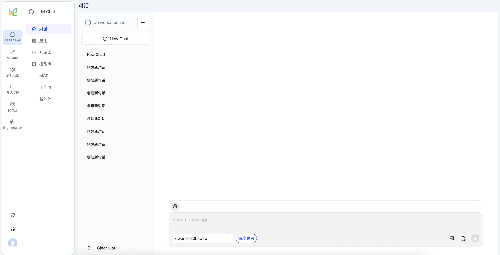
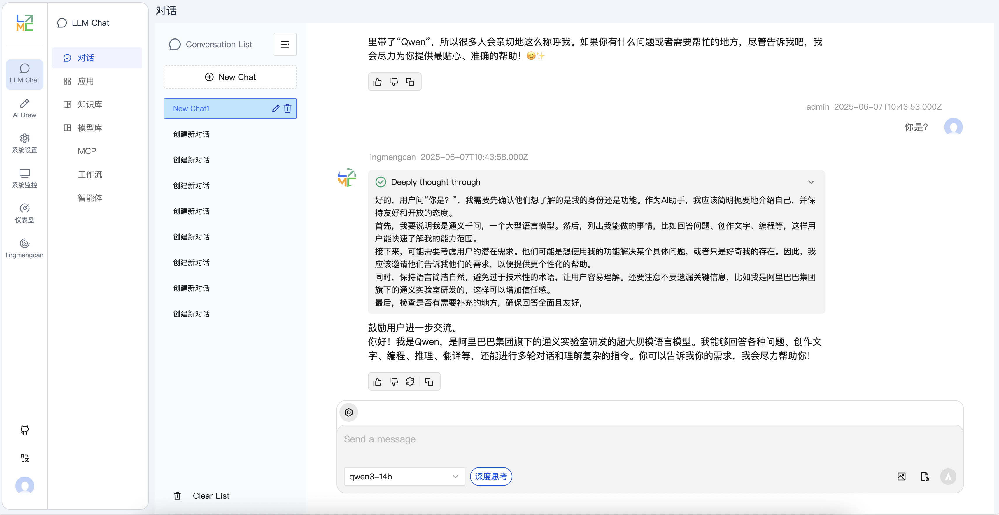
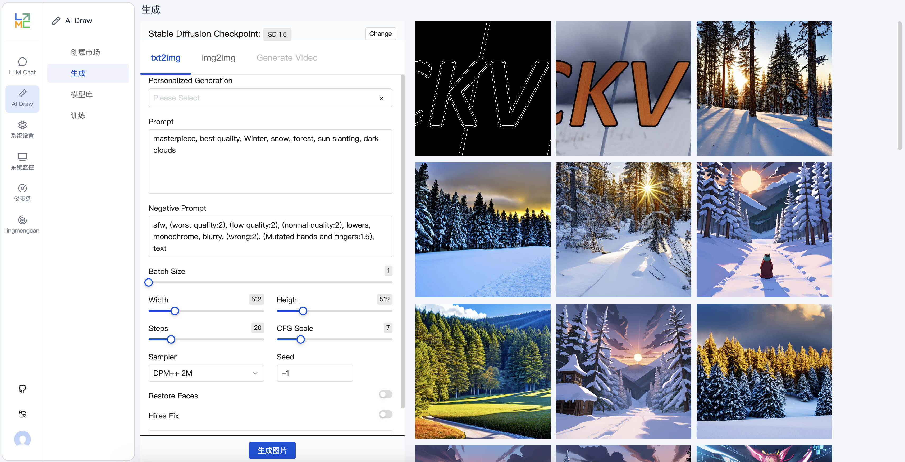
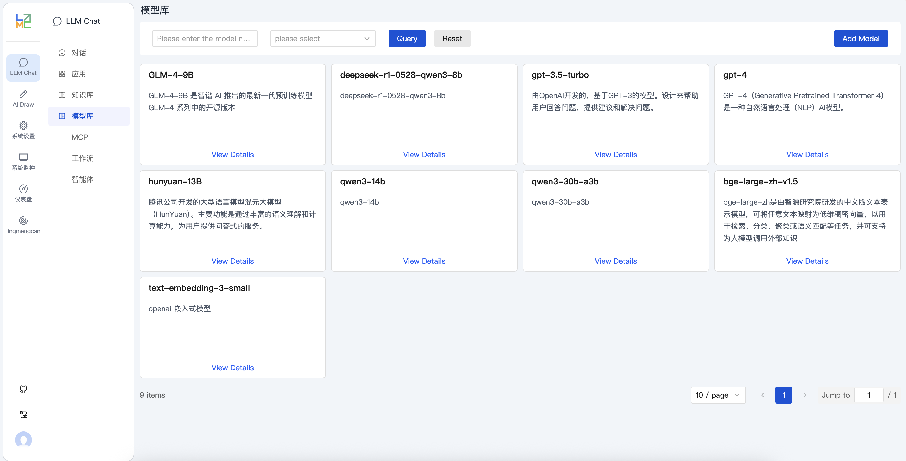
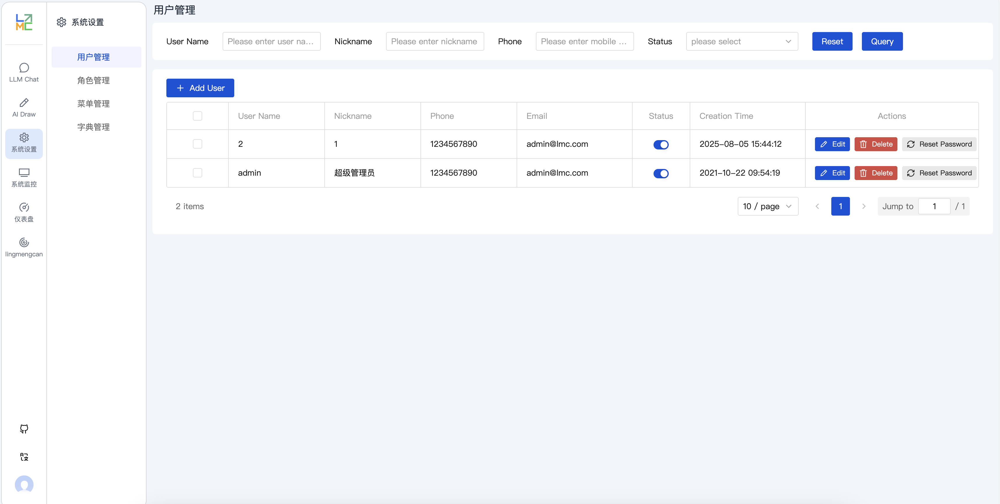
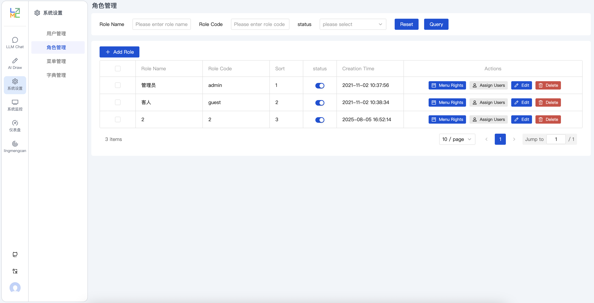
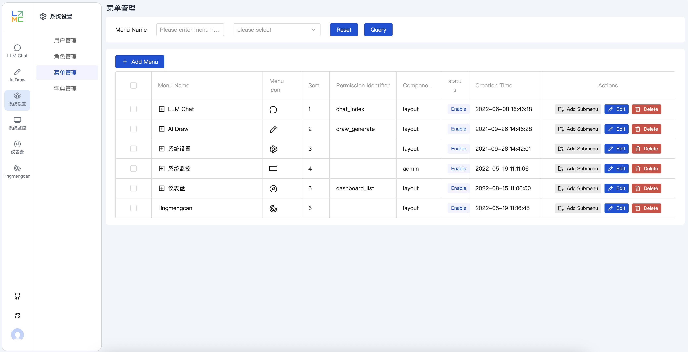

<h1 align="center">Lingmengcan AI Platform</h1>
<p align="center">English | <a href="README.zh-CN.md">中文</a></p>

<p align="center">
  
  
  
  
  
</p>

Lingmengcan is an end-to-end AI application development platform powered by large language models. It provides comprehensive solutions including knowledge base management, intelligent conversations, workflow orchestration, and AI image generation. Built with modern microservice architecture, supporting fully local deployment to ensure enterprise data security.

## ✨ Key Features

- **🤖 Multi-Model Support**: Compatible with OpenAI, Ollama, and other LLMs
- **💬 Intelligent Chat**: Multi-turn conversations, context memory, role-playing
- **📚 Knowledge Base RAG**: Document upload, vectorization, intelligent retrieval enhancement
- **🎨 AI Image Generation**: Integrated Stable Diffusion for text-to-image generation
- **🔄 Workflow**: Visual process orchestration with complex business logic support
- **👥 Permission Management**: Complete RBAC permission system
- **🔒 Private Deployment**: Fully local operation without external dependencies

## 🏗️ Architecture

### Frontend Layer (`web/`)
```
Vue 3 + TypeScript + Vite
├── UI Framework: TDesign + Tailwind CSS
├── State Management: Pinia
├── Routing: Vue Router
└── HTTP Client: Axios
```

### Service Layer (`service/`)
```
NestJS + TypeScript
├── Database: TypeORM + MySQL
├── Authentication: JWT + Passport
├── AI Integration: LangChain + OpenAI API
├── File Storage: Local + Cloud Storage
└── Vector Database: ChromaDB
```

### Core Modules
- **User Management**: Registration, login, permission control
- **Chat System**: Multi-turn conversations, history, streaming output
- **Knowledge Base**: Document parsing, vectorization, similarity search
- **Model Management**: Multi-model configuration, load balancing, monitoring
- **Workflow**: Node orchestration, conditional branches, loop control
- **Drawing System**: Stable Diffusion integration, parameter adjustment

## 🚀 Quick Start

### Requirements

| Component | Version | Description |
|-----------|---------|-------------|
| Node.js | 18+ | Frontend & Backend runtime |
| Python | 3.10+ | AI model environment |
| MySQL | 8.0+ | Primary database |
| pnpm | Latest | Package manager |

### 1️⃣ Clone Repository

```bash
git clone https://github.com/lingmengcan/lingmengcan.git
cd lingmengcan
```

### 2️⃣ Database Setup

```bash
# Create database
mysql -u root -p -e "CREATE DATABASE lingmengcan_ai CHARACTER SET utf8mb4 COLLATE utf8mb4_unicode_ci;"

# Import schema
mysql -u root -p lingmengcan_ai < doc/lingmengcan-ai.sql
```

### 3️⃣ Backend Service

```bash
cd service

# Install dependencies
pnpm install

# Configure environment
cp .env.example .env
# Edit config.development.yaml for database connection

# Start development server
pnpm run start:dev
```

### 4️⃣ Frontend Application

```bash
cd web

# Install dependencies
pnpm install

# Start development server
pnpm dev
```

### 5️⃣ AI Model Deployment (Optional)

#### Option 1: Ollama (Recommended)
Ollama is the simplest local LLM deployment solution, supporting various open-source models.

```bash
# macOS/Linux Installation
curl -fsSL https://ollama.ai/install.sh | sh

# Windows: Download from https://ollama.ai/download/windows

# Download and run models
ollama pull llama2          # Meta Llama 2
ollama pull qwen:7b         # Alibaba Qwen
ollama pull codellama       # Code-specialized model

# Start service (default port 11434)
ollama serve

# Test model
ollama run llama2
```

#### Option 2: LM Studio (GUI Interface)
LM Studio provides a user-friendly graphical interface, suitable for non-technical users.

```bash
# 1. Download and install LM Studio
# Official website: https://lmstudio.ai/

# 2. Search and download models in LM Studio:
# - Qwen/Qwen2-7B-Instruct-GGUF
# - microsoft/Phi-3-mini-4k-instruct-gguf
# - TheBloke/Llama-2-7B-Chat-GGUF

# 3. Start local server
# Click "Local Server" tab in LM Studio
# Select model and click "Start Server"
# Default address: http://localhost:1234/v1
```

#### Option 3: Stable Diffusion WebUI (AI Image Generation)
```bash
# Clone repository
git clone https://github.com/AUTOMATIC1111/stable-diffusion-webui.git
cd stable-diffusion-webui

# Start with API mode
./webui.sh --api --listen --port 7860
# Or Windows: webui-user.bat --api --listen --port 7860

# API address: http://localhost:7860
```

#### Model Configuration

Add model configuration in backend config file `service/config.development.yaml`:

```yaml
# Stable Diffusion Configuration
stablediffusion:
  apiUrl: "http://localhost:7860"
  enabled: true
```

### 6️⃣ Access Application

- 🌐 Frontend: http://localhost:8089
- 🔧 Backend API: http://localhost:3000
- 👤 Default Account: `admin` / `123456`

## 📱 Screenshots

> **⚠️ Important Notice**: The following screenshots are from early versions. Current version has significant UI and feature updates - screenshots need to be updated urgently!

### 💬 Intelligent Chat System
**New Features**:
- ✅ Multi-turn conversations with context understanding
- ✅ Knowledge base RAG enhancement
- ✅ Streaming output with typewriter effect
- ✅ Real-time model switching and comparison
- ✅ Conversation history management
- ✅ Export conversation records

<div align="center">
  
  
</div>

### 🎨 AI Image Generation Studio
**New Features**:
- ✅ Text-to-Image generation
- ✅ Image style transfer and editing
- ✅ Advanced parameter fine-tuning
- ✅ Batch generation and management
- ✅ ControlNet precise control
- ✅ Image version history management

<div align="center">
  
</div>

### 🤖 Model Library
<div align="center">
  
</div>

### ⚙️ System Management Center
Complete enterprise-level admin system

| 👥 User Permission Management | 🔐 Role Permission System |
|-------------------------------|---------------------------|
|  |  |
| • User information management<br>• Permission assignment<br>• Login logs | • RBAC permission model<br>• Fine-grained control<br>• Permission inheritance |

| 📋 Menu Route Management |
|--------------------------|
|  |
| • Dynamic menu configuration<br>• Route permissions<br>• Menu icons |

### 📚 Knowledge Base Management (New Feature)
- 📄 Multi-format document upload (PDF, Word, Markdown)
- 🔍 Intelligent document parsing and chunking
- 🧠 Vectorization storage and retrieval
- 💡 Knowledge base Q&A with citations
- 📊 Usage statistics
- 🔄 Version management and rollback

### 🔄 Workflow Orchestrator (New Feature)
- 🎨 Visual process designer
- 🔀 Conditional branches and loop control
- 🤖 Multi-AI model collaboration
- ⏰ Scheduled task execution
- 📊 Execution monitoring and logs
- 🔧 Custom node development

---

## 📸 Screenshot Update Checklist

**🚨 Urgent Screenshot Updates Needed**:

### Core Feature Screenshots
- [ ] **Chat Interface** - Show new UI, streaming output, model switching
- [ ] **AI Drawing** - Show parameter panels, ControlNet, batch generation
- [ ] **Knowledge Base** - Document upload, vector search, Q&A interface
- [ ] **Workflow Designer** - Visual designer, node configuration
- [ ] **Model Management** - Multi-model config, performance monitoring

### System Management Screenshots
- [ ] **User Management** - New user list, permission assignment interface
- [ ] **Role Management** - RBAC permission tree, role configuration
- [ ] **Menu Management** - Dynamic menu config, route management
- [ ] **System Monitoring** - Performance metrics, usage statistics

### Mobile Adaptation
- [ ] **Responsive Design** - Mobile chat interface
- [ ] **Mobile Drawing** - Touch-optimized interface
- [ ] **Mobile Admin** - Simplified admin interface

### Multi-language Interface
- [ ] **English Interface** - Complete English version screenshots
- [ ] **Dark Theme** - Dark mode interface showcase

**Recommended Screenshot Specifications**:
- Resolution: 1920x1080 or higher
- Format: PNG (for clarity)
- Content: Show real data, avoid empty interfaces
- Annotations: Add callouts for important features

## 📁 Project Structure

```
lingmengcan/
├── 📁 web/                    # Frontend (Vue 3 + TypeScript)
│   ├── src/
│   │   ├── api/              # API layer
│   │   ├── components/       # Reusable components
│   │   ├── views/            # Page views
│   │   ├── store/            # State management (Pinia)
│   │   ├── router/           # Route configuration
│   │   └── utils/            # Utility functions
│   └── package.json
├── 📁 service/               # Backend (NestJS + TypeScript)
│   ├── src/
│   │   ├── controllers/      # Controller layer
│   │   ├── services/         # Business logic layer
│   │   ├── entities/         # Data models
│   │   ├── modules/          # Feature modules
│   │   ├── dtos/             # Data transfer objects
│   │   └── utils/            # Utility classes
│   └── package.json
├── 📁 doc/                   # Documentation
│   ├── lingmengcan-ai.sql    # Database schema
│   └── *.md                  # Documentation files
├── 📁 images/                # Screenshots
└── README.md
```

## 🔧 Configuration

### Backend Config (`service/config.development.yaml`)

```yaml
# Database configuration
database:
  host: localhost
  port: 3306
  username: root
  password: your_password
  database: lingmengcan_ai

# AI model configuration
llm:
  openai:
    apiKey: your_openai_key
    baseURL: https://api.openai.com/v1
  
  ollama:
    baseURL: http://localhost:11434

# Stable Diffusion configuration
stablediffusion:
  apiUrl: http://localhost:7860
```

### Frontend Config (`web/.env.development`)

```env
# API base URL
VITE_API_BASE_URL=http://localhost:3000

# Application title
VITE_APP_TITLE=Lingmengcan AI Platform
```

## 🤝 Contributing

We welcome all forms of contributions!

1. 🍴 Fork the repository
2. 🌿 Create feature branch (`git checkout -b feature/AmazingFeature`)
3. 💾 Commit changes (`git commit -m 'Add some AmazingFeature'`)
4. 📤 Push to branch (`git push origin feature/AmazingFeature`)
5. 🔀 Open Pull Request

### Development Guidelines

- Code Style: ESLint + Prettier
- Commit Convention: Conventional Commits
- Test Coverage: Add tests for new features

## 📄 License

This project is licensed under the [MIT](LICENSE) License

## 🌟 Star History

[](https://star-history.com/#lingmengcan/lingmengcan&Date)

## 💬 Community

- 💬 QQ Group: **651535270**
- 📧 Email: lingmengcan@example.com
- 🐛 Issues: [GitHub Issues](https://github.com/lingmengcan/lingmengcan/issues)

## 🙏 Acknowledgments

Thanks to the following open source projects:

- [Vue.js](https://vuejs.org/) - Progressive JavaScript Framework
- [NestJS](https://nestjs.com/) - Enterprise Node.js Framework
- [LangChain](https://langchain.com/) - AI Application Development Framework
- [Stable Diffusion](https://github.com/AUTOMATIC1111/stable-diffusion-webui) - AI Image Generation
- [TDesign](https://tdesign.tencent.com/) - Vue 3 Component Library

---

<div align="center">
  <p>⭐ If this project helps you, please give us a Star!</p>
  <p>Made with ❤️ by Lingmengcan</p>
</div>