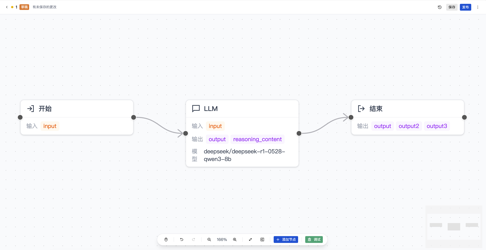
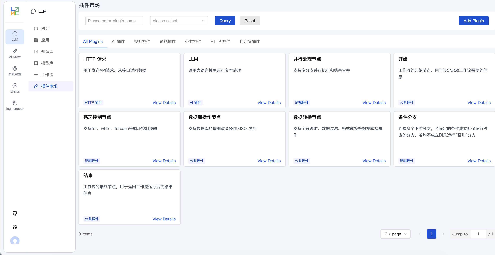

<h1 align="center">Lingmengcan AI 应用平台</h1>
<p align="center"><a href="README.md">English</a> | 中文</p>

<p align="center">
  
  
  
  
  
</p>

Lingmengcan 是一个基于大语言模型的端到端 AI 应用开发平台，提供知识库管理、智能对话、工作流编排、AI 绘图等一站式解决方案。平台采用现代化微服务架构，支持完全本地化部署，保障企业数据安全。

## ✨ 核心特性

- **🤖 多模型支持**: 兼容 OpenAI、Ollama、DeepSeek 等多种大语言模型
- **💬 智能对话**: 支持多轮对话、上下文记忆、流式输出
- **📚 知识库 RAG**: 文档上传、向量化存储、智能检索增强
- **🎨 AI 绘图**: 集成 Stable Diffusion，支持文本生成图像
- **🔄 工作流引擎**: 拖拽式可视化设计器，丰富节点类型，实时调试
- **🧩 插件市场**: 可扩展的插件系统，支持自定义节点开发
- **👥 权限管理**: 完整的 RBAC 权限体系
- **🔒 私有部署**: 完全本地化运行，无需依赖外网

## 🏗️ 技术架构

### 前端层 (`web/`)
```
Vue 3 + TypeScript + Vite
├── UI 框架: TDesign + Tailwind CSS
├── 状态管理: Pinia
├── 路由管理: Vue Router
└── HTTP 客户端: Axios
```

### 服务层 (`service/`)
```
NestJS + TypeScript
├── 数据库: TypeORM + MySQL
├── 身份认证: JWT + Passport
├── AI 集成: LangChain + OpenAI API
├── 文件存储: 本地存储 + 云存储
└── 向量数据库: ChromaDB
```

### 核心模块
- **用户管理**: 用户注册、登录、权限控制
- **对话系统**: 多轮对话、历史记录、流式输出
- **知识库**: 文档解析、向量化、相似度检索
- **模型管理**: 多模型配置、负载均衡、监控
- **工作流引擎**: 可视化设计器、节点编排、实时调试
- **插件市场**: 插件管理、动态加载、自定义扩展
- **绘图系统**: Stable Diffusion 集成、参数调节

## 🚀 快速开始

### 环境要求

| 组件 | 版本 | 说明 |
|------|------|------|
| Node.js | 18+ | 前后端运行环境 |
| Python | 3.10+ | AI 模型环境 |
| MySQL | 8.0+ | 主数据库 |
| pnpm | 最新 | 包管理工具 |

### 1️⃣ 克隆项目

```bash
git clone https://github.com/lingmengcan/lingmengcan.git
cd lingmengcan
```

### 2️⃣ 数据库初始化

```bash
# 创建数据库
mysql -u root -p -e "CREATE DATABASE lingmengcan_ai CHARACTER SET utf8mb4 COLLATE utf8mb4_unicode_ci;"

# 导入数据结构
mysql -u root -p lingmengcan_ai < doc/lingmengcan-ai.sql
```

### 3️⃣ 后端服务

```bash
cd service

# 安装依赖
pnpm install

# 配置环境变量
cp .env.example .env
# 编辑 config.development.yaml 配置数据库连接

# 启动开发服务
pnpm run start:dev
```

### 4️⃣ 前端应用

```bash
cd web

# 安装依赖
pnpm install

# 启动开发服务
pnpm dev
```

### 5️⃣ AI 模型部署 (可选)

#### 方案一：Ollama (推荐)
Ollama 是最简单的本地大模型部署方案，支持多种开源模型。

```bash
# macOS/Linux 安装
curl -fsSL https://ollama.ai/install.sh | sh

# Windows 安装：下载 https://ollama.ai/download/windows

# 下载并运行模型
ollama pull llama2          # Meta Llama 2
ollama pull qwen:7b         # 阿里通义千问
ollama pull codellama       # 代码专用模型

# 启动服务 (默认端口 11434)
ollama serve

# 测试模型
ollama run llama2
```

#### 方案二：LM Studio (图形化界面)
LM Studio 提供友好的图形界面，适合非技术用户。

```bash
# 1. 下载安装 LM Studio
# 官网：https://lmstudio.ai/

# 2. 在 LM Studio 中搜索并下载模型：
# - Qwen/Qwen2-7B-Instruct-GGUF
# - microsoft/Phi-3-mini-4k-instruct-gguf
# - TheBloke/Llama-2-7B-Chat-GGUF

# 3. 启动本地服务器
# 在 LM Studio 中点击 "Local Server" 标签
# 选择模型并点击 "Start Server"
# 默认地址：http://localhost:1234/v1
```

#### 方案三：Stable Diffusion WebUI (AI 绘图)
```bash
# 克隆项目
git clone https://github.com/AUTOMATIC1111/stable-diffusion-webui.git
cd stable-diffusion-webui

# 启动 API 模式
./webui.sh --api --listen --port 7860
# 或 Windows: webui-user.bat --api --listen --port 7860

# API 地址：http://localhost:7860
```

#### 模型配置说明


```yaml
# Stable Diffusion 配置
stablediffusion:
  apiUrl: "http://localhost:7860"
  enabled: true
```

### 6️⃣ 访问应用

- 🌐 前端地址: http://localhost:8089
- 🔧 后端 API: http://localhost:3000
- 👤 默认账号: `admin` / `123456`

## 📱 功能展示

> **⚠️ 重要提示**: 以下截图为早期版本，当前版本界面和功能已有重大更新，急需重新截图！

### 💬 智能对话系统
**新功能特性**:
- ✅ 多轮对话、上下文理解
- ✅ 知识库 RAG 增强问答  
- ✅ 流式输出、打字机效果
- ✅ 多模型实时切换对比
- ✅ 对话历史管理
- ✅ 导出对话记录

<div align="center">
  
  
</div>

### 🎨 AI 绘图工作台
**新功能特性**:
- ✅ 文本生成图像 (Text-to-Image)
- ✅ 图像风格转换和编辑
- ✅ 高级参数精细调节
- ✅ 批量生成和管理
- ✅ ControlNet 精确控制
- ✅ 图像历史版本管理

<div align="center">
  
</div>

### 🤖 模型库
<div align="center">
  
</div>

### ⚙️ 系统管理中心
完整的企业级后台管理系统

| 👥 用户权限管理 | 🔐 角色权限体系 |
|----------------|----------------|
|  |  |
| • 用户信息管理<br>• 权限分配<br>• 登录日志 | • RBAC 权限模型<br>• 细粒度控制<br>• 权限继承 |

| 📋 菜单路由管理 |
|----------------|
|  |
| • 动态菜单配置<br>• 路由权限<br>• 菜单图标 |

### 📚 知识库管理
- 📄 多格式文档上传 (PDF、Word、Markdown)
- 🔍 智能文档解析和分块
- 🧠 向量化存储和检索
- 💡 知识库问答和引用
- 📊 知识库使用统计
- 🔄 版本管理和回滚

### 🔄 工作流引擎
基于 Vue Flow 的可视化拖拽式工作流设计器：



**设计器功能**:
- 🎨 拖拽式画布，支持节点连接
- 🔍 画布缩放、自动布局、小地图导航
- ↩️ 撤销/重做历史记录
- 💾 自动保存 (30秒间隔)
- 📤 工作流导入/导出 (JSON 格式)

**丰富节点类型**:
| 节点类型 | 功能描述 |
|---------|---------|
| **LLM 节点** | 大语言模型调用，支持模型选择、temperature/top_p/max_tokens 参数、系统/用户提示词 |
| **条件节点** | IF/ELIF/ELSE 条件分支，支持 AND/OR 逻辑组合 |
| **HTTP 节点** | 外部 API 调用 (GET/POST/PUT/DELETE)，请求头、鉴权、超时重试 |
| **循环节点** | 三种循环模式：for (计数)、while (条件)、foreach (遍历) |
| **并行节点** | 并行分支执行，支持等待全部/任一完成/竞速模式 |
| **数据库节点** | 数据库 CRUD 操作，支持多数据源 |
| **数据转换节点** | 数据格式转换和处理 |

**实时调试**:
- 🐛 集成调试面板
- 📊 流式/非流式执行模式
- 📝 执行日志查看
- 🖼️ 支持文本和图片输入

### 🧩 插件市场
可扩展的插件系统，支持自定义工作流节点：



- 📦 **插件分类**: AI 插件、规则插件、逻辑插件、HTTP 插件、自定义插件
- 🔌 **动态加载**: 工作流设计器自动加载已启用的插件节点
- ⚙️ **配置化**: 通过 JSON Schema 定义节点配置表单
- 📋 **版本管理**: 插件版本控制和作者追踪
- 🎯 **搜索过滤**: 快速搜索和分类筛选


## 📁 项目结构

```
lingmengcan/
├── 📁 web/                    # 前端项目 (Vue 3 + TypeScript)
│   ├── src/
│   │   ├── api/              # API 接口层
│   │   ├── components/       # 通用组件
│   │   ├── views/            # 页面视图
│   │   ├── store/            # 状态管理 (Pinia)
│   │   ├── router/           # 路由配置
│   │   └── utils/            # 工具函数
│   └── package.json
├── 📁 service/               # 后端服务 (NestJS + TypeScript)
│   ├── src/
│   │   ├── controllers/      # 控制器层
│   │   ├── services/         # 业务逻辑层
│   │   ├── entities/         # 数据模型
│   │   ├── modules/          # 功能模块
│   │   ├── dtos/             # 数据传输对象
│   │   └── utils/            # 工具类
│   └── package.json
├── 📁 doc/                   # 项目文档
│   ├── lingmengcan-ai.sql    # 数据库结构
│   └── *.md                  # 说明文档
├── 📁 images/                # 项目截图
└── README.md
```

## 🔧 配置说明

### 后端配置 (`service/config.development.yaml`)

```yaml
# 数据库配置
database:
  host: localhost
  port: 3306
  username: root
  password: your_password
  database: lingmengcan_ai

# AI 模型配置
llm:
  openai:
    apiKey: your_openai_key
    baseURL: https://api.openai.com/v1
  
  ollama:
    baseURL: http://localhost:11434

# Stable Diffusion 配置
stablediffusion:
  apiUrl: http://localhost:7860
```

### 前端配置 (`web/.env.development`)

```env
# API 基础地址
VITE_API_BASE_URL=http://localhost:3000

# 应用标题
VITE_APP_TITLE=Lingmengcan AI Platform
```

## 🤝 贡献指南

我们欢迎所有形式的贡献！

1. 🍴 Fork 本仓库
2. 🌿 创建特性分支 (`git checkout -b feature/AmazingFeature`)
3. 💾 提交更改 (`git commit -m 'Add some AmazingFeature'`)
4. 📤 推送到分支 (`git push origin feature/AmazingFeature`)
5. 🔀 开启 Pull Request

### 开发规范

- 代码风格: 使用 ESLint + Prettier
- 提交规范: 遵循 Conventional Commits
- 测试覆盖: 新功能需要添加测试用例

## 📄 许可证

本项目基于 [MIT](LICENSE) 许可证开源

## 🌟 Star History

[](https://star-history.com/#lingmengcan/lingmengcan&Date)

## 💬 社区交流

- 💬 QQ 交流群: **651535270**
- 📧 邮箱: lingmengcan@example.com
- 🐛 问题反馈: [GitHub Issues](https://github.com/lingmengcan/lingmengcan/issues)

## 🙏 致谢

感谢以下开源项目的支持：

- [Vue.js](https://vuejs.org/) - 渐进式 JavaScript 框架
- [NestJS](https://nestjs.com/) - 企业级 Node.js 框架
- [LangChain](https://langchain.com/) - AI 应用开发框架
- [Stable Diffusion](https://github.com/AUTOMATIC1111/stable-diffusion-webui) - AI 图像生成
- [TDesign](https://tdesign.tencent.com/) - Vue 3 组件库

---

<div align="center">
  <p>⭐ 如果这个项目对你有帮助，请给我们一个 Star！</p>
  <p>Made with ❤️ by Lingmengcan</p>
</div>