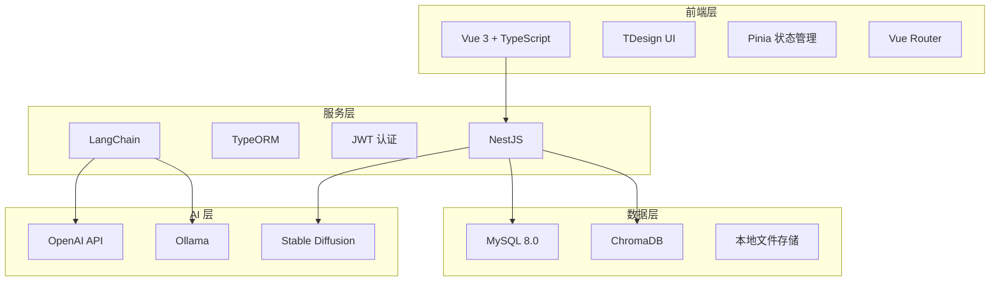
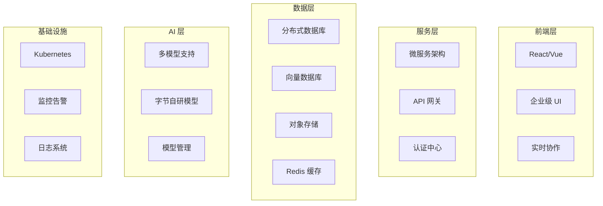

# Lingmengcan AI 平台 vs Coze Studio 功能对比分析

## 📋 文档概述

本文档基于 Lingmengcan AI 平台现有功能，与 Coze Studio（字节跳动一站式 AI Agent 开发平台）进行全面的功能对比分析，识别优势、差距和改进方向。

**分析日期**: 2025年10月20日  
**Lingmengcan 版本**: v1.0.3.20250807  
**对比基准**: Coze Studio 公开功能特性

---

## 🎯 平台定位对比

### Lingmengcan AI 平台
- **定位**: 端到端 AI 应用开发平台
- **核心价值**: 本地化部署、企业数据安全、开源可控
- **目标用户**: 企业开发者、技术团队、需要私有化部署的组织
- **部署方式**: 完全本地化部署，支持私有云

### Coze Studio
- **定位**: 一站式 AI Agent 开发平台
- **核心价值**: 快速开发、丰富生态、云端协作
- **目标用户**: 个人开发者、企业团队、AI 应用创业者
- **部署方式**: SaaS 云服务为主

---

## 🔍 核心功能对比矩阵

| 功能模块 | Lingmengcan | Coze Studio | 差距等级 | 优势/劣势分析 |
|---------|-------------|-------------|---------|--------------|
| **🤖 多模型支持** | ⭐⭐⭐⭐ | ⭐⭐⭐⭐⭐ | 🟡 中 | **L**: 支持 OpenAI、Ollama 等主流模型<br>**C**: 集成更多模型，包括字节自研模型<br>**差距**: 模型种类和深度集成 |
| **💬 对话系统** | ⭐⭐⭐⭐⭐ | ⭐⭐⭐⭐⭐ | 🟢 低 | **L**: 多轮对话、流式输出、上下文记忆<br>**C**: 类似功能，体验优化更好<br>**优势**: 功能对等，本地化部署更安全 |
| **📚 知识库 RAG** | ⭐⭐⭐⭐ | ⭐⭐⭐⭐⭐ | 🟡 中 | **L**: 文档上传、向量化、ChromaDB<br>**C**: 更强大的文档解析和检索优化<br>**差距**: 文档解析能力、检索精度 |
| **🔄 工作流编排** | ⭐⭐⭐ | ⭐⭐⭐⭐⭐ | 🔴 高 | **L**: 基础可视化编辑器，7种节点类型<br>**C**: 完整工作流引擎，丰富节点库<br>**差距**: 节点类型、调试工具、模板系统 |
| **🔌 插件生态** | ⭐⭐ | ⭐⭐⭐⭐⭐ | 🔴 高 | **L**: 基础插件管理，无市场<br>**C**: 丰富插件市场，第三方生态<br>**差距**: 插件数量、市场机制、开发者生态 |
| **🎨 AI 绘图** | ⭐⭐⭐⭐ | ⭐⭐⭐ | 🟢 优势 | **L**: 深度集成 Stable Diffusion<br>**C**: 基础图像生成<br>**优势**: 更专业的绘图功能 |
| **👥 权限管理** | ⭐⭐⭐⭐⭐ | ⭐⭐⭐⭐ | 🟢 优势 | **L**: 完整 RBAC 权限体系<br>**C**: 基础权限管理<br>**优势**: 企业级权限控制 |
| **🔒 私有部署** | ⭐⭐⭐⭐⭐ | ⭐⭐ | 🟢 优势 | **L**: 完全本地化部署<br>**C**: 主要为云服务<br>**优势**: 数据安全、可控性强 |
| **🤝 实时协作** | ⭐ | ⭐⭐⭐⭐⭐ | 🔴 高 | **L**: 无协作功能<br>**C**: 完整多人协作系统<br>**差距**: 实时编辑、团队管理 |
| **📝 Prompt 工程** | ⭐⭐ | ⭐⭐⭐⭐⭐ | 🔴 高 | **L**: 基础 Prompt 配置<br>**C**: 专业 Prompt 调试工具<br>**差距**: 调试工具、版本管理、优化建议 |
| **🧪 自动化评测** | ⭐ | ⭐⭐⭐⭐⭐ | 🔴 高 | **L**: 无评测系统<br>**C**: 完整评测体系<br>**差距**: 测试框架、评估指标、报告系统 |
| **📊 可观测性** | ⭐⭐ | ⭐⭐⭐⭐⭐ | 🔴 高 | **L**: 基础日志记录<br>**C**: 全链路追踪、监控面板<br>**差距**: 监控工具、告警系统、性能分析 |
| **📦 模板市场** | ⭐ | ⭐⭐⭐⭐⭐ | 🔴 高 | **L**: 无模板系统<br>**C**: 丰富模板库<br>**差距**: 模板数量、分类、分享机制 |
| **🎯 多模态支持** | ⭐⭐⭐ | ⭐⭐⭐⭐⭐ | 🟡 中 | **L**: 文本 + 图像<br>**C**: 文本 + 图像 + 音频 + 视频<br>**差距**: 音频、视频处理能力 |

**评分说明**:
- ⭐⭐⭐⭐⭐: 功能完善，行业领先
- ⭐⭐⭐⭐: 功能完整，满足需求
- ⭐⭐⭐: 基础功能，有待增强
- ⭐⭐: 功能简单，需要改进
- ⭐: 功能缺失或极简

**差距等级**:
- 🟢 低/优势: Lingmengcan 具有优势或差距较小
- 🟡 中: 存在一定差距，需要优化
- 🔴 高: 差距明显，需要重点改进

---

## 💪 Lingmengcan 核心优势

### 1. 完全本地化部署 ⭐⭐⭐⭐⭐
```yaml
优势详情:
  - 数据安全: 所有数据存储在本地，无外网依赖
  - 可控性强: 完全掌控系统运行和数据流向
  - 合规性: 满足金融、政府等行业的数据合规要求
  - 定制化: 可根据企业需求深度定制
  
技术实现:
  - Docker 容器化部署
  - 支持 Kubernetes 编排
  - 完整的部署文档和脚本
  - 本地 AI 模型支持（Ollama、LM Studio）
```

### 2. 企业级权限管理 ⭐⭐⭐⭐⭐
```typescript
// 完整的 RBAC 权限体系
interface PermissionSystem {
  用户管理: {
    用户信息管理: true,
    权限分配: true,
    登录日志: true
  },
  角色管理: {
    RBAC权限模型: true,
    细粒度控制: true,
    权限继承: true
  },
  菜单管理: {
    动态菜单配置: true,
    路由权限: true,
    菜单图标: true
  }
}
```

### 3. 专业 AI 绘图功能 ⭐⭐⭐⭐
```yaml
Stable Diffusion 深度集成:
  - 文本生成图像 (Text-to-Image)
  - 图像风格转换和编辑
  - 高级参数精细调节
  - 批量生成和管理
  - ControlNet 精确控制
  - 图像历史版本管理
  
优势:
  - 比 Coze 更专业的绘图能力
  - 支持本地模型部署
  - 完全可控的生成过程
```

### 4. 开源可控 ⭐⭐⭐⭐⭐
```yaml
开源优势:
  - MIT 许可证
  - 代码完全开放
  - 社区驱动发展
  - 可自由修改和扩展
  - 无供应商锁定风险
  
技术栈透明:
  - 前端: Vue 3 + TypeScript + TDesign
  - 后端: NestJS + TypeScript + TypeORM
  - AI: LangChain + ChromaDB
  - 所有依赖清晰可见
```

### 5. 现代化技术架构 ⭐⭐⭐⭐
```typescript
// 前端技术栈
const frontendStack = {
  framework: 'Vue 3',
  language: 'TypeScript',
  ui: 'TDesign + Tailwind CSS',
  state: 'Pinia',
  build: 'Vite'
};

// 后端技术栈
const backendStack = {
  framework: 'NestJS',
  language: 'TypeScript',
  orm: 'TypeORM',
  database: 'MySQL 8.0',
  ai: 'LangChain',
  vector: 'ChromaDB'
};
```

---

## 🚨 Lingmengcan 核心差距

### 1. 工作流编排能力 🔴 高优先级

#### 当前状态
```typescript
// 现有节点类型（7种）
const currentNodes = [
  'start',           // 开始节点
  'end',             // 结束节点
  'llm',             // 大模型节点
  'condition',       // 条件分支节点 ✅
  'http',            // HTTP API 节点 ✅
  'loop',            // 循环节点（新增）
  'parallel',        // 并行节点（新增）
  'transform',       // 数据转换节点（新增）
  'database'         // 数据库节点（新增）
];

// 缺失功能
const missingFeatures = [
  '调试工具',        // 断点、单步执行
  '实时预览',        // 执行过程可视化
  '模板系统',        // 工作流模板库
  '版本管理',        // 工作流版本控制
  '性能分析',        // 执行性能监控
  '错误处理',        // 完善的异常处理
];
```

#### Coze 工作流优势
- **节点类型丰富**: 20+ 种预置节点
- **调试工具完善**: 断点、变量监控、执行路径可视化
- **模板生态**: 丰富的行业模板和最佳实践
- **协作编辑**: 多人实时协作编辑工作流

#### 改进建议
```typescript
// 第一阶段：节点扩展（已部分实现）
- ✅ 条件分支节点
- ✅ HTTP API 节点
- 🔄 循环控制节点（开发中）
- 🔄 并行处理节点（开发中）
- 🔄 数据转换节点（开发中）
- 🔄 数据库操作节点（开发中）

// 第二阶段：调试工具
- 断点调试系统
- 变量值监控面板
- 执行路径可视化
- 性能分析工具

// 第三阶段：生态建设
- 工作流模板库
- 版本管理系统
- 协作编辑功能
```

### 2. 插件生态建设 🔴 高优先级

#### 当前状态
```typescript
// 现有插件系统
interface CurrentPluginSystem {
  管理功能: {
    插件列表: true,
    插件启用禁用: true,
    插件配置: true
  },
  缺失功能: {
    插件市场: false,      // ❌ 无插件商店
    插件开发SDK: false,   // ❌ 无开发工具包
    插件评分: false,      // ❌ 无评分系统
    插件分享: false,      // ❌ 无分享机制
    热加载: false,        // ❌ 无热加载
    沙箱隔离: false       // ❌ 无安全沙箱
  }
}
```

#### Coze 插件生态优势
- **插件市场**: 数百个第三方插件
- **开发者工具**: 完整的插件开发 SDK
- **安全机制**: 插件沙箱隔离
- **社区活跃**: 活跃的开发者社区

#### 改进建议
```typescript
// 插件市场架构
class PluginMarketplace {
  features = {
    插件商店: {
      分类浏览: true,
      搜索功能: true,
      评分系统: true,
      下载统计: true
    },
    开发者工具: {
      SDK工具包: true,
      开发文档: true,
      调试工具: true,
      发布流程: true
    },
    安全机制: {
      代码审查: true,
      沙箱隔离: true,
      权限控制: true,
      安全扫描: true
    }
  };
}
```

### 3. Prompt 工程化工具 🔴 高优先级

#### 当前状态
```yaml
现有功能:
  - 基础 Prompt 配置
  - 简单的变量替换
  - 无调试工具
  - 无版本管理
  - 无优化建议
```

#### Coze Prompt 工具优势
- **可视化编辑器**: 语法高亮、自动补全
- **调试工具**: 实时测试、多版本对比
- **优化建议**: AI 驱动的 Prompt 优化
- **A/B 测试**: 多版本效果对比

#### 改进建议
```typescript
// Prompt 工程化平台
class PromptEngineeringPlatform {
  编辑器功能 = {
    语法高亮: true,
    自动补全: true,
    变量插值: true,
    模板管理: true
  };
  
  调试工具 = {
    实时测试: true,
    版本对比: true,
    性能分析: true,
    AB测试: true
  };
  
  优化功能 = {
    自动优化建议: true,
    最佳实践推荐: true,
    效果评估: true,
    历史记录: true
  };
}
```

### 4. 实时协作功能 🔴 高优先级

#### 当前状态
```yaml
协作功能: 无
现状:
  - 单用户操作
  - 无实时同步
  - 无团队管理
  - 无权限隔离
```

#### Coze 协作优势
- **实时编辑**: 多人同时编辑工作流
- **团队管理**: 完整的团队空间和成员管理
- **权限控制**: 细粒度的协作权限
- **冲突解决**: 自动处理编辑冲突

#### 改进建议
```typescript
// 实时协作系统
class CollaborationSystem {
  实时编辑 = {
    WebSocket通信: true,
    操作转换算法: true,  // OT/CRDT
    冲突解决: true,
    历史记录: true
  };
  
  团队管理 = {
    团队空间: true,
    成员管理: true,
    角色分配: true,
    资源隔离: true
  };
  
  协作工具 = {
    评论系统: true,
    任务分配: true,
    通知机制: true,
    版本控制: true
  };
}
```

### 5. 自动化评测体系 🔴 高优先级

#### 当前状态
```yaml
评测功能: 无
缺失:
  - 无测试框架
  - 无评估指标
  - 无自动化测试
  - 无性能分析
  - 无质量报告
```

#### Coze 评测优势
- **完整评测体系**: 准确性、性能、成本等多维度评估
- **自动化测试**: 单元测试、集成测试、回归测试
- **可视化报告**: 详细的评测报告和趋势分析
- **持续优化**: 基于评测结果的优化建议

#### 改进建议
```typescript
// 自动化评测系统
class AutomatedEvaluationSystem {
  评测指标 = {
    准确性评测: ['BLEU', 'ROUGE', 'F1-Score'],
    响应时间: ['P50', 'P95', 'P99'],
    成本分析: ['Token消耗', 'API调用次数'],
    用户满意度: ['评分', '反馈']
  };
  
  测试框架 = {
    单元测试: true,
    集成测试: true,
    性能测试: true,
    回归测试: true
  };
  
  报告系统 = {
    可视化报告: true,
    趋势分析: true,
    问题诊断: true,
    优化建议: true
  };
}
```

### 6. 全链路可观测性 🟡 中优先级

#### 当前状态
```typescript
// 现有监控
const currentMonitoring = {
  日志记录: '基础日志',
  性能监控: '无',
  链路追踪: '无',
  告警系统: '无',
  监控面板: '无'
};
```

#### Coze 可观测性优势
- **链路追踪**: 完整的请求链路追踪
- **监控面板**: 实时监控大屏
- **告警系统**: 智能告警和通知
- **日志分析**: 结构化日志和搜索

#### 改进建议
```typescript
// 可观测性平台
class ObservabilityPlatform {
  链路追踪 = {
    请求追踪: 'OpenTelemetry',
    性能监控: 'Prometheus',
    错误定位: true,
    依赖分析: true
  };
  
  监控面板 = {
    实时监控: 'Grafana',
    关键指标: true,
    告警机制: 'AlertManager',
    历史数据: true
  };
  
  日志管理 = {
    结构化日志: 'ELK Stack',
    日志搜索: 'Elasticsearch',
    日志分析: 'Kibana',
    日志归档: true
  };
}
```

---

## 📊 技术架构对比

### Lingmengcan 技术架构



**架构特点**:
- ✅ 现代化技术栈
- ✅ 微服务友好
- ✅ 完全本地化
- ❌ 缺少缓存层（Redis）
- ❌ 缺少消息队列
- ❌ 缺少监控系统

### Coze Studio 技术架构（推测）



**架构特点**:
- ✅ 云原生架构
- ✅ 高可用设计
- ✅ 完整监控体系
- ✅ 弹性伸缩
- ❌ 依赖云服务
- ❌ 数据在云端

---

## 🎯 功能详细对比

### 1. 对话系统对比

| 功能点 | Lingmengcan | Coze Studio | 说明 |
|--------|-------------|-------------|------|
| 多轮对话 | ✅ | ✅ | 两者都支持 |
| 上下文记忆 | ✅ | ✅ | 两者都支持 |
| 流式输出 | ✅ | ✅ | 两者都支持 |
| 角色扮演 | ✅ | ✅ | 两者都支持 |
| 对话历史 | ✅ | ✅ | 两者都支持 |
| 导出对话 | ✅ | ✅ | 两者都支持 |
| 多模型切换 | ✅ | ✅ | 两者都支持 |
| 实时协作对话 | ❌ | ✅ | Coze 支持 |
| 对话分析 | ❌ | ✅ | Coze 支持 |

**结论**: 基础功能对等，Coze 在协作和分析方面更强

### 2. 知识库 RAG 对比

| 功能点 | Lingmengcan | Coze Studio | 说明 |
|--------|-------------|-------------|------|
| 文档上传 | ✅ PDF, Word, Markdown | ✅ 更多格式 | Coze 支持更多格式 |
| 向量化存储 | ✅ ChromaDB | ✅ 企业级向量库 | Coze 性能更好 |
| 智能检索 | ✅ 相似度检索 | ✅ 混合检索 | Coze 检索更精准 |
| 文档解析 | ⚠️ 基础解析 | ✅ 高级解析 | Coze 解析能力更强 |
| 知识图谱 | ❌ | ✅ | Coze 支持 |
| 引用溯源 | ✅ | ✅ | 两者都支持 |
| 版本管理 | ✅ | ✅ | 两者都支持 |
| 使用统计 | ✅ | ✅ | 两者都支持 |

**结论**: Lingmengcan 具备基础功能，Coze 在解析和检索方面更强

### 3. 工作流编排对比

| 功能点 | Lingmengcan | Coze Studio | 说明 |
|--------|-------------|-------------|------|
| 可视化编辑器 | ✅ 基础 | ✅ 完善 | Coze 体验更好 |
| 节点类型 | ⚠️ 9种 | ✅ 20+ 种 | Coze 节点更丰富 |
| 条件分支 | ✅ | ✅ | 两者都支持 |
| 循环控制 | 🔄 开发中 | ✅ | Coze 已支持 |
| 并行处理 | 🔄 开发中 | ✅ | Coze 已支持 |
| 调试工具 | ❌ | ✅ | Coze 支持断点调试 |
| 实时预览 | ❌ | ✅ | Coze 支持 |
| 模板系统 | ❌ | ✅ | Coze 有丰富模板 |
| 版本管理 | ❌ | ✅ | Coze 支持 |
| 协作编辑 | ❌ | ✅ | Coze 支持 |

**结论**: 这是最大的差距，需要重点改进

### 4. AI 绘图对比

| 功能点 | Lingmengcan | Coze Studio | 说明 |
|--------|-------------|-------------|------|
| 文本生成图像 | ✅ | ✅ | 两者都支持 |
| 图像编辑 | ✅ | ⚠️ | Lingmengcan 更强 |
| 风格转换 | ✅ | ⚠️ | Lingmengcan 更强 |
| ControlNet | ✅ | ❌ | Lingmengcan 独有 |
| 参数调节 | ✅ 高级 | ⚠️ 基础 | Lingmengcan 更专业 |
| 批量生成 | ✅ | ✅ | 两者都支持 |
| 历史管理 | ✅ | ✅ | 两者都支持 |
| 本地模型 | ✅ | ❌ | Lingmengcan 独有 |

**结论**: Lingmengcan 在 AI 绘图方面具有明显优势

### 5. 权限管理对比

| 功能点 | Lingmengcan | Coze Studio | 说明 |
|--------|-------------|-------------|------|
| RBAC 权限 | ✅ 完整 | ✅ 基础 | Lingmengcan 更完善 |
| 用户管理 | ✅ | ✅ | 两者都支持 |
| 角色管理 | ✅ | ✅ | 两者都支持 |
| 菜单权限 | ✅ | ⚠️ | Lingmengcan 更细粒度 |
| 数据权限 | ✅ | ⚠️ | Lingmengcan 更完善 |
| 审计日志 | ✅ | ✅ | 两者都支持 |
| SSO 集成 | ⚠️ | ✅ | Coze 支持更多 |

**结论**: Lingmengcan 在企业级权限管理方面更强

---

## 💡 改进优先级建议

### 🔴 高优先级（3个月内）

#### 1. 工作流引擎增强
```yaml
目标: 达到 Coze 80% 的工作流能力
任务:
  - 完成循环、并行、转换、数据库节点开发
  - 实现基础调试工具（断点、变量监控）
  - 添加工作流模板系统
  - 优化可视化编辑器体验
  
预期收益:
  - 开发效率提升 50%
  - 支持更复杂的业务场景
  - 提升用户体验
```

#### 2. 插件生态建设
```yaml
目标: 建立基础插件市场
任务:
  - 设计插件开发 SDK
  - 实现插件沙箱隔离
  - 开发插件市场界面
  - 预置 20+ 常用插件
  
预期收益:
  - 扩展平台能力边界
  - 吸引开发者生态
  - 降低定制开发成本
```

#### 3. Prompt 工程化工具
```yaml
目标: 提供专业的 Prompt 开发环境
任务:
  - 开发可视化 Prompt 编辑器
  - 实现实时测试和调试功能
  - 添加版本管理和对比
  - 集成 AI 优化建议
  
预期收益:
  - AI 应用质量提升 40%
  - 降低 Prompt 开发门槛
  - 提升开发效率
```

### 🟡 中优先级（6个月内）

#### 4. 实时协作功能
```yaml
目标: 支持团队协作开发
任务:
  - 实现 WebSocket 实时通信
  - 开发操作转换算法（OT/CRDT）
  - 构建团队管理系统
  - 添加评论和任务功能
  
预期收益:
  - 支持团队协作开发
  - 提升团队效率
  - 增强产品竞争力
```

#### 5. 自动化评测体系
```yaml
目标: 建立完整的质量保证体系
任务:
  - 实现评测引擎和指标体系
  - 开发测试用例管理系统
  - 构建可视化报告系统
  - 集成持续集成流程
  
预期收益:
  - 应用质量提升 50%
  - 降低维护成本
  - 提升用户信任
```

#### 6. 全链路可观测性
```yaml
目标: 实现生产级监控能力
任务:
  - 集成 Prometheus + Grafana
  - 实现链路追踪（OpenTelemetry）
  - 部署 ELK 日志系统
  - 配置告警系统
  
预期收益:
  - 问题定位效率提升 80%
  - 系统稳定性提升
  - 运维成本降低
```

### 🟢 低优先级（9个月内）

#### 7. 多模态支持增强
```yaml
目标: 支持音频和视频处理
任务:
  - 集成语音识别（STT）
  - 集成语音合成（TTS）
  - 添加视频处理能力
  - 实现多模态融合
  
预期收益:
  - 扩展应用场景
  - 提升产品竞争力
```

#### 8. 模板市场建设
```yaml
目标: 降低使用门槛
任务:
  - 构建模板库系统
  - 预置 50+ 行业模板
  - 实现模板分享机制
  - 添加模板评分系统
  
预期收益:
  - 降低使用门槛
  - 加速应用开发
  - 促进社区活跃
```

---

## 📈 竞争力分析

### SWOT 分析

#### Strengths（优势）
```yaml
技术优势:
  - 完全本地化部署，数据安全可控
  - 开源架构，无供应商锁定
  - 企业级权限管理
  - 专业的 AI 绘图功能
  - 现代化技术栈

市场优势:
  - 满足企业数据合规需求
  - 支持深度定制
  - 成本可控
  - 社区驱动发展
```

#### Weaknesses（劣势）
```yaml
功能差距:
  - 工作流能力不足
  - 缺少插件生态
  - 无实时协作
  - 无自动化评测
  - 可观测性不足

生态差距:
  - 用户规模小
  - 社区不够活跃
  - 第三方集成少
  - 文档和教程不足
```

#### Opportunities（机会）
```yaml
市场机会:
  - 企业对数据安全的重视
  - 开源 AI 工具的需求增长
  - 私有化部署市场扩大
  - AI 应用开发门槛降低

技术机会:
  - 开源 AI 模型快速发展
  - 云原生技术成熟
  - 低代码/无代码趋势
  - AI Agent 市场爆发
```

#### Threats（威胁）
```yaml
竞争威胁:
  - Coze 等大厂产品竞争
  - 其他开源项目竞争
  - 技术迭代速度快
  - 用户习惯难以改变

技术威胁:
  - AI 技术快速变化
  - 开源模型质量提升
  - 云服务成本降低
  - 新技术范式出现
```

### 竞争策略建议

#### 1. 差异化定位
```yaml
核心定位: 企业级私有化 AI 应用开发平台

差异化优势:
  - 数据安全: 完全本地化，满足合规要求
  - 可控性: 开源架构，深度定制
  - 专业性: 企业级权限、专业绘图
  - 成本: 一次部署，长期使用

目标客户:
  - 金融、政府、医疗等对数据安全要求高的行业
  - 需要深度定制的大型企业
  - 技术能力强的开发团队
  - 重视数据主权的组织
```

#### 2. 功能补齐策略
```yaml
短期（3个月）:
  - 工作流引擎增强 → 达到基本可用
  - 插件系统建设 → 建立基础生态
  - Prompt 工具 → 提升开发体验

中期（6个月）:
  - 实时协作 → 支持团队开发
  - 自动化评测 → 保证应用质量
  - 可观测性 → 提升运维能力

长期（9个月）:
  - 多模态支持 → 扩展应用场景
  - 模板市场 → 降低使用门槛
  - 性能优化 → 提升用户体验
```

#### 3. 生态建设策略
```yaml
开发者生态:
  - 完善开发文档
  - 提供视频教程
  - 举办技术沙龙
  - 建立开发者社区

插件生态:
  - 发布插件开发 SDK
  - 举办插件开发大赛
  - 提供插件开发奖励
  - 建立插件认证体系

用户生态:
  - 建立用户社区
  - 收集用户反馈
  - 提供技术支持
  - 分享最佳实践
```

---

## 🎯 总结与建议

### 核心结论

1. **功能对等性**: Lingmengcan 在基础功能上与 Coze 基本对等，但在高级功能上存在明显差距

2. **差异化优势**: Lingmengcan 在本地化部署、数据安全、权限管理、AI 绘图方面具有明显优势

3. **主要差距**: 工作流编排、插件生态、实时协作、自动化评测是最大的差距

4. **市场定位**: 应聚焦企业级私有化部署市场，与 Coze 的云服务形成差异化竞争

### 战略建议

#### 短期（3个月）
```yaml
核心目标: 补齐关键功能短板
重点任务:
  1. 工作流引擎增强（高优先级）
  2. 插件生态建设（高优先级）
  3. Prompt 工程化工具（高优先级）
  
成功指标:
  - 工作流节点类型达到 15+
  - 插件市场上线，预置 20+ 插件
  - Prompt 编辑器上线，支持调试
```

#### 中期（6个月）
```yaml
核心目标: 提升协作和质量保证能力
重点任务:
  1. 实时协作功能（中优先级）
  2. 自动化评测体系（中优先级）
  3. 全链路可观测性（中优先级）
  
成功指标:
  - 支持 10+ 人同时协作
  - 评测覆盖率达到 80%
  - 监控系统全面上线
```

#### 长期（9个月）
```yaml
核心目标: 完善生态，提升竞争力
重点任务:
  1. 多模态支持增强（低优先级）
  2. 模板市场建设（低优先级）
  3. 性能优化和体验提升
  
成功指标:
  - 支持音频、视频处理
  - 模板库达到 50+ 个
  - 系统性能提升 50%
```

### 最终目标

**在 9 个月内，将 Lingmengcan 打造成为：**

1. **功能完整**: 达到 Coze 80% 的功能覆盖
2. **差异化明显**: 在私有化部署、数据安全、企业级管理方面领先
3. **生态活跃**: 建立活跃的开发者和用户社区
4. **市场认可**: 成为企业级 AI 应用开发平台的首选

---

## 📚 参考资料

### 相关文档
- [优化需求文档-基于Coze平台对比分析.md](./优化需求文档-基于Coze平台对比分析.md)
- [技术方案文档-平台优化实施.md](./技术方案文档-平台优化实施.md)
- [工作流编辑器产品文档.md](./工作流编辑器产品文档.md)

### 技术参考
- [Coze Studio 官方文档](https://www.coze.com/)
- [LangChain 文档](https://langchain.com/)
- [NestJS 文档](https://nestjs.com/)
- [Vue 3 文档](https://vuejs.org/)

---

## 📅 文档信息

- **创建时间**: 2025年10月20日
- **版本**: v1.0
- **作者**: AI 助手
- **状态**: 已完成
- **下次更新**: 根据项目进展定期更新

---

<div align="center">
  <p><strong>Lingmengcan AI 平台 - 企业级私有化 AI 应用开发平台</strong></p>
  <p>Made with ❤️ by Lingmengcan Team</p>
</div>
